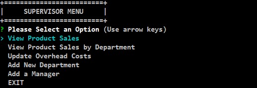

# Bamazon-SQL

Bamazon is a homework asignment that was completed for the Penn LPS coding bootcamp. The basic goal was to create a program that used the command line to mimic an on-line marketplace. The code interfaces with a database to persist the data across sessions and across modules. I completed all of the optional assignments as well, which were to create a 'manager' module to manipulate the product data in another way other than a purchase, and a 'supervisor' module which added a few extra columns to the SQL tables to do some fun data manipulation. Let's start by going over the Customer module first.

<h2>BamazonCustomer.js</h2>

The bamazon customer module works pretty much like how you would expect. There is a listing of products available for purchase that is displayed to the customer. The program asks for the id of the item and then the quantity. It then does the database query to determine if there is sufficient quantity of that item.  If there is enough quantity to fill the order the order it filled, the quantity is updated and the sale is noted in the database for the other modules to use. 
  

<h2>BamazonManager.js</h2>

The bamazon manager module is where I started adding on some additional functionality. The first thing we see is a login prompt. This was optional, and runs off another database table that I made specifically for this purpose. The inquirer has an option for "password" so that content is hidden while the user types. There are only 5 failed attempts before the program exits and the counter is reset. Once the login is successful, the user is presented with a menu. 
  

 
The option 'View products for sale' does just that - querys the database for the products, and returns their info, including the quantity - which is not shown in the customer table. I also wrote my own table-making routine for this part. I know there are options to do it with console.table or a npm package - which i did use for the other modules - but I wanted to keep this here because I liked how it came out. 
  

 
The option to 'View Low Inventory' also does just what it says - querys the database for products and shows any products that have a quantity less than 5. I run the same display function for this result, and there is a 'catch' message if there are no products that have low inventory. 
  
<table>
<tr>
<td>Shown with Low inventory</td><td> Shown with 'catch' message</td></tr>
<tr>
<td></td><td></td></tr>
</table>

The next option for the manager is to add to the inventory of an item, perhaps to log a delivery of product to the warehouse. This will query all of the products and display them, and prompt the user for the id of the product to add inventory, and then the quantity to be added. An update query is sent to the database, and a confirmation message is sent to the user showing the new quantity. 
  

 
The final option for this module is to add a new item to the inventory. This will take in input from the user and add the product to the database. The user enters a product description, department, price, and quantity. This information is then shown back to the user to confirm the information the are adding, and once confirmed the data is added to the database and and future querys will show the new inventory item. 
  

 
<h2>BamazonSupervisor.js</h2>

The final module I did uses an authentication that is defined in the .env, not in the database. I felt like trying multiple options for having authentication and this was another way to do it that I explored. Once authenticated, the user is presented with a menu, similar to the manager module. 
  

 
The first option functions very much like it does for the manager database, but uses the cli-table package to display the information in a table.   

 
The second menu uses a menu option to join a departments table with the products table, grouping the products by department and presenting a sum of their sales and comparing them to an 'overhead' cost number to show profits. 
  

 
The final few options I will not show pictures for, because they show functionality that has already been demonstrated in other modules. There is an option to update the overhead costs for a department, which takes in information and updates the departments table with the new information. Adding a new department takes in department information and then adds that information to the departments table. Adding a manager allows the supervisor to add a manager to the manager table, setting an initial password. 
  
If i had more time, I would probably add an option for the managers to update their passwords, and potentially added some columns and functionality to the managers table. I would also consider using the 'manager' table more like an employee table, and giving some fields that show what those users have acesss to do and manipulate, and perhaps include some additional steps to things like adding a supervisor sign-off of sorts on adding products. 